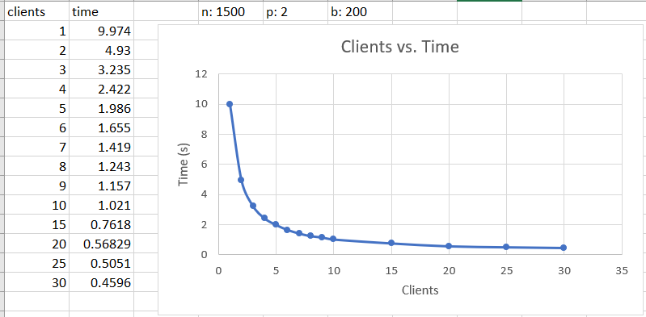

## Description

In this program, a client is requesting data from a server over the network. Data request and retrieval is optimized by threading.

## Tools
* Parallel Processes (Threading)
* Network Communication (Sockets)

## Implementation

### Main Server Function
In the main function for the server, the port is determined by the user and the IP address will be localhost. The constructor for the Network Request Channel is called, which builds a vector of file descriptors for each client thread that connects to it. A thread is called for each connection between the client and server. The main function passes each thread to the handle_process_loop function where that server thread will wait for messages from the client until a quit message is receieved. When a quit message is receieved, the socket will return from the handle_process_loop function and join back to the main program. This main function will wait until all threads have joined, before it terminates. 

```java
int main(int argc, char *argv[]) {
	string port;
	string IP;

	if (argc != 3) 
  {
		EXITONERROR("Server: incomplete command line arg");
	}

	port = string(argv[3]);
	IP = "127.0.0.1"; // localhost 
	NetworkRequestChannel control_channel("control", NetworkRequestChannel::SERVER_SIDE, IP, port);
  
  pthread_t* threads = new pthread_t[control_channel.getSockVec().size()];
  vector<NetworkRequestChannel*> net_channels;

	for (int i = 0; i < control_channel.getSockVec().size(); i++)
	{
		// declare a new request channel that holds the socket for each thread
		net_channels.push_back(new NetworkRequestChannel(control_channel.getSockVec().at(i)));
	}
	for (int i = 0; i < control_channel.getSockVec().size(); i++)
	{
		pthread_create(&threads[i], 0, handle_process_loop, net_channels.at(i));
	}

	// join threads
	int join_count = 0;
	for (int i = 0; i < control_channel.getSockVec().size(); i++)
	{
		join_count++;
		pthread_join(threads[i], 0);
		cout << "server thread " << join_count << " joined" << endl;
	}
	return 0;
  

}
```

## Sockets

Here is the Network Request Channel Constructor for the server side:

```java
if (_side == SERVER_SIDE)
	{
		//set flags (localhost for server)
		hints.ai_flags = AI_PASSIVE;

		// get address info
		if ((status = getaddrinfo(NULL, port_ptr, &hints, &info)) != 0)
		{
			cerr << "getaddrinfo: " << gai_strerror(status) << endl;
			exit(1);
		}

		// create listener socket
		sockListen = socket(info->ai_family, info->ai_socktype, info->ai_protocol);
		if (sockListen < 0)
		{
			perror("server: socket");
			exit(1);
		}

		// bind socket
		if (bind(sockListen, info->ai_addr, info->ai_addrlen) == -1)
		{
			perror("server: bind");
			exit(1);
		}

		freeaddrinfo(info); // done with this struct

		// set a listener
		if (listen(sockListen, 10) == -1)
		{
			perror("server: listen");
			exit(1);
		}

		// connect initial contact with client
		if ((_socket_ = accept(sockListen, (struct sockaddr*)&client_addr, &client_sock_size)) == -1)
		{
			perror("server: ");
			exit(1);
		}

		// get # of worker threads from client
		char* buf = new char[MAX_MESSAGE];

		int byte_count;
		if ((byte_count = recv(_socket_, buf, MAX_MESSAGE, 0)) < 0)
		{
			perror("Error: receieve failure");
			exit(1);
		}
		datamsg* thread_msg = (datamsg*)buf;
		socket_vector.push_back(_socket_);
		cout << "socket " << _socket_ << " added to vector on server side" << endl;

		w = thread_msg->person;

		clients = w;  // set member variable

		// let them know we got it
		this->cwrite(buf, sizeof(datamsg) + 1);

		client_sock_size = sizeof(client_addr);
		for (int i = 0; i < w; i++)
		{
			// connect to client
			if ((_socket_ = accept(sockListen, (struct sockaddr*)&client_addr, &client_sock_size)) == -1)
			{
				perror("server: ");
				exit(1);
			}
			// add the socket fd to the vector
			socket_vector.push_back(_socket_);
			cout << "socket " << _socket_ << " added to vector on server side" << endl;
		}
	}
```

The getaddrinfo() function returns a struct of connection info that is used by bind() and connect(). A listener socket is declared, to be used by bind() and accept(). Bind() assigns the Sockets file descriptor to the address info. Listen() sets the listener Socket to be passive, so that it can be used to receive incoming connections. Accept() is the function that connects to the client. A file descriptor is returned from accept() which is the communication channel between the connected parties. Next, the server receives its first message from the client (using recv()) which contains the number of threads that the client wants to connect. The server sends a message back to the client, confirming that the message has been receieved, then uses that number in the for loop which will establish all of the connections. In this loop, the server waits for a connection, and once received, puts the file descriptor for that socket into a vector which is used in the main function to create server threads.

## Process Loop

After the connections are made with all of the client threads, each server thread enters a process loop where it receieves data requests from the client. The server threads access the data, and send it to the client. When the client thread is complete, it sends a quit message to the server thread, and the server thread exits the process loop and joins the main function. 

## Read and Write

After the client connects to the server, all communication is done using a read and write function defined in the Network Request Channel class. 

### Read

```java
ssize_t recv(int sockfd, void *buf, size_t len, int flags);
```
The recv function is a Linux function used to receieve a message from the other end of a Socket connection. The
*sockfd* argument is the file descriptor of the Socket. The *buf* argument is the buffer that will be filled with the data transmitted by the other side. *len* is the size of the message received. I implement it here:

```java
if ((byte_count = recv(_socket_, buf, MAX_MESSAGE, 0)) < 0) {
	perror("Error: receieve failure");
	exit(1);
}
```

### Write

```java
ssize_t send(int sockfd, const void *buf, size_t len, int flags);
```
The send function is the Linux function used to send a message to the other end of the Socket connection. The *buf* in the send function if filled with the data to be sent to the other side. I implement it here:

```java
if ((send(_socket_, msg, len, 0)) < 0) {
	EXITONERROR("cwrite");
}
```

## Threading 
Threading is used in any modern program that has processes which can be performed in parallel. Threading can be easily explained with a real world example. Imagine that a builder needs to sheetrock the walls in a house, and install a new roof on that same house. If he is working alone, he will complete one of those tasks, and then complete the other. While he is working on the roof, nothing is being accomplished with the walls and vice versa. That is an example of a synchronous program, no threading. On the other hand, imagine he has two teams, one team works on the roof while the other does sheetrock. Two tasks are now being accomplished in parallel. He is threading! Needless to say, threading speeds up a program. Not all programs can be threaded though. Any process that must occur sequentially cannot be threaded. This would be synonomous to a builder mistakenly trying to install a toilet before the plumbing is finished. The plumbing must come before the toilet. Threading is performed on both the client and server side in this program. The client creates a user defined number of threads which send data request messages to the server. They also receieve the data back from the server and place the data in a file or histogram depending on what the user is requesting. Here are the Linux functions I use in this program to perform threading:

### Create Thread

```java
int pthread_create(pthread_t *thread, const pthread_attr_t *attr, void *(*start_routine) (void *), void *arg);
```
This function creates a new thread and calls the *start_routine* function. This is the function that the thread runs. Each thread runs independant of the program which called it, but it has all the information that the calling program had before the thread was called.

### Join Thread
It is imperitave that the threads join back to the main program once they are done working. Threads operate independantly of the program that called them, so this function is how we know that they are done with the task appointed to them. 

```java
int pthread_join(pthread_t thread, void **retval);
```

## Threads vs. Time

The following graph represent the number of threads versus the speed of data retrieval in seconds. There is an approximately 2,000% increase in speed from 1 thread to 30. Other factors besides simply the number of threads are going to affect the speed of the program. With more data points to be collected and a larger bounded buffer size we would see the trend continue with more threads accordingly. It is important to understand what the bottlenecks in a program are, in order to optimize it. 



## Comments
I have not included my full solution or made my repository for this project public since it is a current project at the University and I do not want to aid plaigarism. I have shared this in order to show the process in which a two computers communicate over the network, and how threading is performed in Linux.
